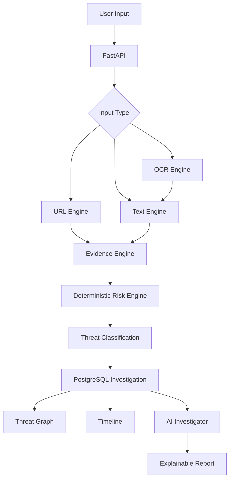

# Threatly

## AI-Powered Digital Threat Investigation Platform

> Detect. Investigate. Explain.

Threatly analyzes suspicious URLs, messages, and screenshots. It extracts observable evidence, calculates a deterministic risk score, visualizes investigation relationships, preserves a timeline, and optionally generates an explainable analyst report.

## Why Threatly

Most tools stop at a verdict. Threatly shows why an input is suspicious and preserves the investigation trail behind the assessment.

```text
Input -> Detection -> Evidence -> Risk -> Classification -> Graph -> AI Explanation
```

Core principle:

> Rules detect. Evidence supports. Risk Engine scores. AI explains.

The AI does not calculate or replace the deterministic risk score. It explains the supplied findings and provides defensive recommendations.

## Features

- URL analysis with static structural indicators. Submitted URLs are not blindly fetched.
- Text analysis for urgency, credential, financial, threat-language, and URL indicators.
- Screenshot OCR using Tesseract for PNG, JPEG, and WEBP files up to 5 MB.
- Evidence records with severity and analyzer source.
- Deterministic 0-100 risk scoring and threat classification.
- React Flow threat graphs for URL, text, and screenshot investigations.
- PostgreSQL-backed investigation history and case reopening.
- Investigation timeline from creation through AI report generation.
- AI analyst reports with untrusted-data and prompt-injection boundaries.
- Safe one-click synthetic demo scenarios for URL and message investigations.

## Architecture



## Technology

- Frontend: React, Vite, JavaScript, CSS, Lucide React, React Flow
- Backend: Python, FastAPI, SQLAlchemy, Pydantic
- Analysis: deterministic URL/text engines, Tesseract OCR
- Persistence: PostgreSQL
- AI: OpenAI Responses API
- Validation: pytest, Oxlint

## Project Structure

```text
THREATLY/
├── backend/
│   ├── app/
│   │   ├── ai/              # AI investigation reports
│   │   ├── api/             # analysis, investigations, reports
│   │   ├── core/            # security limits and rate limiting
│   │   ├── database/        # models, events, initialization
│   │   └── engines/         # URL, text, OCR, evidence, risk, graph
│   ├── tests/
│   ├── requirements.txt
│   └── .env.example
├── frontend/
│   └── src/
│       ├── components/      # graph and timeline components
│       ├── App.jsx
│       └── index.css
├── docs/
├── .env.example
└── README.md
```

## Local Setup

Requirements: Python 3.11+, Node.js, Docker Desktop, Git, and Tesseract OCR.

### PostgreSQL

```powershell
docker run --name threatly-postgres `
  -e POSTGRES_USER=threatly `
  -e POSTGRES_PASSWORD=threatly_dev_password `
  -e POSTGRES_DB=threatly `
  -p 5432:5432 `
  -d postgres:16
```

If the container already exists:

```powershell
docker start threatly-postgres
```

### Backend

```powershell
cd D:\THREATLY\backend
python -m venv venv
.\venv\Scripts\Activate.ps1
pip install -r requirements.txt
Copy-Item .env.example .env
python -m app.database.init_db
uvicorn app.main:app --reload
```

Set a real `OPENAI_API_KEY` only in the local `.env`. Never commit it.

- API: http://127.0.0.1:8000
- Swagger: http://127.0.0.1:8000/docs
- Health: http://127.0.0.1:8000/health

### Frontend

```powershell
cd D:\THREATLY\frontend
npm install
npm run dev
```

Open http://localhost:5173.

## API Endpoints

| Method | Endpoint | Purpose |
|---|---|---|
| GET | `/health` | API health check |
| POST | `/api/analyze/url` | Static URL analysis |
| POST | `/api/analyze/text` | Text analysis |
| POST | `/api/analyze/image` | OCR analysis and persisted image investigation |
| POST | `/api/investigations` | Create URL or text investigation |
| GET | `/api/investigations` | Investigation history |
| GET | `/api/investigations/{id}` | Investigation details |
| GET | `/api/investigations/{id}/evidence` | Evidence records |
| GET | `/api/investigations/{id}/graph` | Threat graph |
| GET | `/api/investigations/{id}/timeline` | Investigation timeline |
| POST | `/api/reports/{id}` | AI analyst report |

## Demo Flow

1. Open the frontend.
2. Click `Run Phishing URL` or `Run Fake Bank SMS`.
3. Review the risk score, evidence, decision trace, timeline, and graph.
4. Generate the AI investigation report.
5. Upload a synthetic phishing screenshot to demonstrate OCR -> text analysis -> evidence -> graph.
6. Open History and reopen a persisted case.

Synthetic examples use fictional domains and dummy content. Do not use real credentials or sensitive screenshots.

## Security Architecture

### Input Security

- URL and text length validation
- Image MIME, size, empty-file, and integrity validation
- Request rate limiting on investigation creation

### Analysis Security

- Submitted URLs are analyzed statically and not blindly fetched
- Evidence is generated by deterministic analyzers
- SSRF-prone live retrieval is intentionally outside the MVP

### AI Security

- URLs, messages, OCR text, filenames, and evidence are untrusted data
- Prompt-injection text is analyzed as data, not followed as instructions
- AI cannot change the deterministic risk score
- AI failure leaves the deterministic assessment available

### Secrets and Privacy

- Secrets belong in ignored `.env` files
- `backend/.env.example` contains placeholders only
- Redaction, retention, consent, provider selection, and audit policy should be expanded for production deployment

## Testing

```powershell
cd D:\THREATLY\backend
.\venv\Scripts\Activate.ps1
pytest -q
```

The suite includes risk-engine regression tests and adversarial input tests for empty/oversized text, invalid images, oversized images, and malformed image content.

```powershell
cd D:\THREATLY\frontend
npm run build
npx oxlint src/App.jsx
```

## Current Limitations

Threatly is a hackathon MVP, not a complete enterprise SOC. Detection coverage is rule-based, OCR quality depends on image quality, reputation enrichment is limited, and AI report generation requires a configured provider key.

## Roadmap

- Threat-intelligence and domain-age enrichment
- Email and browser-extension workflows
- Malware attachment analysis and sandboxing
- Analyst collaboration and enterprise authentication
- Distributed deployment and observability

## Project

Built for Hack Devengers 2.0.

**Threatly — Detect. Investigate. Explain.**
